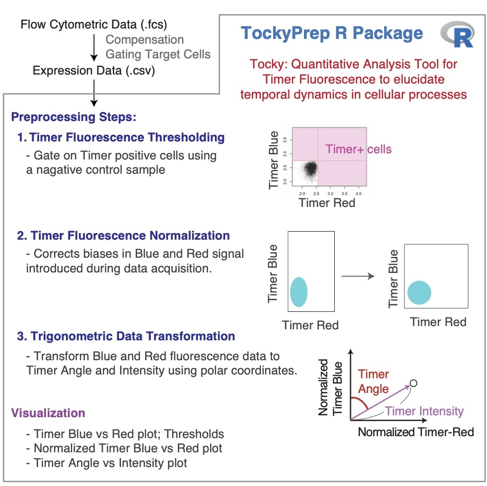

# TockyPrep: Data Preprocessing Methods for Fluorescent Timer Reporter Data


<a href="https://monotockylab.github.io/TockyPrep/">


</a>


**Author:** Dr. Masahiro Ono  
**Date:** 6 November 2024

## Introduction - The R Package for Fluorescent Timer Data Aalysis

Fluorescent Timer proteins uniquely change their emission spectra over time and serve as powerful tools for monitoring the dynamic processes within cells. These proteins are crucial for understanding the intricate temporal dynamics of cellular events. Despite their potential, the analysis of Timer fluorescence data in flow cytometry is often complicated by variability in instrument settings and the absence of standardized data preprocessing methods. To overcome these challenges, the **TockyPrep** package has been developed. This R package provides a comprehensive suite of tools designed to automate the preprocessing, normalization, and trigonometric transformation of Timer fluorescence data.

The **TockyPrep** package aims to standardize the analysis of Timer fluorescence to improve reproducibility and accuracy across various experimental setups. It specifically addresses the normalization of immature and mature Timer fluorescence as a critical step for robust analysis. This approach is central to understanding the maturation dynamics of Timer proteins, and is implemented using advanced trigonometric transformations.


## The **TockyPrep** R Package
The **TockyPrep** R package provides data preprocessing methods for Fluorescent Timer data for analyzing temporal dynamics in cellular activities using flow cytometry.

#### Key Features of **TockyPrep**

Specifically, the **TockyPrep** package provides essential data preprocessing methods for analyzing Fluorescent Timer data:

1. **Timer Fluorescence Normalization**: 
   - This feature corrects for any instrumental biases that may affect the fluorescence readings, ensuring that the measurements of Timer Blue and Timer Red fluorescence are accurate and comparable across different experimental setups. This normalization is crucial for accurate assessment of the maturation state of the Timer protein, as it adjusts for variability in the signal intensity between different cells and samples.

2. **Timer Fluorescence Thresholding**: 
   - To enhance the reliability of Timer data analysis, this method filters out background noise by setting thresholds that distinguish between Timer-positive and Timer-negative cells. This is vital for focusing the analysis on cells that express the Timer protein, thereby eliminating data points that could distort the interpretation of temporal dynamics.

3. **Trigonometric Transformation**: 
   - This transformation computes two new metrics, Timer Angle and Timer Intensity, from the normalized fluorescence data. These metrics are pivotal for quantifying the dynamics of Timer protein maturation within cells, providing insights into the timing and progression of cellular events.

4. **Sample Definition**: 
   - **TockyPrep** aids in organizing and labeling flow cytometry data files for streamlined analysis. It automates the identification of sample groups and control samples, facilitating more efficient subsequent data analyses.

5. **Visualization Tools**: 
   - The package includes functions to visualize both raw and transformed Timer fluorescence data. These tools allow users to generate plots that illustrate the distribution of Timer fluorescence within samples or to track the transformation results, such as plotting Timer Angle versus Timer Intensity. These visualizations are crucial for preliminary data assessment, enabling researchers to quickly identify trends or anomalies that warrant further investigation.

#### Availability

- **TockyPrep** is freely available for distribution via GitHub:

Link to the repository: [TockyPrep on GitHub](https://github.com/MonoTockyLab/TockyPrep)

#### The scehametic figure below provides an overview on the workflows within TockyPrep.


## Getting Started with TockyPrep

To begin using **TockyPrep**, install the package from GitHub using the following command:

```R
# Install TockyPrep from GitHub
devtools::install_github("MonoTockyLab/TockyPrep")
```

## 4. Package Documentation

The **TockyPrep** package documentation is available online:

- **Website**: [https://MonoTockyLab.github.io/TockyPrep/](https://MonoTockyLab.github.io/TockyPrep/)

This site includes all the function reference manuals and vignettes (tutorials).

In addition to the HTML manual pages, a PDF manual for the **TockyPrep** package is available. You can find it in the installed package directory under `doc/`, or you can access it directly from [GitHub](https://github.com/MonoTockyLab/TockyPrep/blob/main/inst/doc/TockyPrep_0.1.0.pdf).

<br>

## 5. Copyright, License, and Citation Guidelines

### Copyright

All code and original graphical content within the TockyPrep package, including anime-like characters and logos, are copyrighted by [Masahiro Ono](https://monotockylab.github.io/). 

### License

The distribution and modification are governed by the Apache License 2.0, which ensures that all users have the freedom to use and change the software in a way that respects the original authorship. See the [LICENSE](https://github.com/MonoTockyLab/TockyPrep/blob/main/LICENSE) file for more information.

### Citing TockyPrep

If you use ** TockyPrep** in your research, please cite:

Masahiro Ono (2024). *TockyPrep: Data Preprocessing Methods for Flow Cytometric Fluorescent Timer Analysis.* arXiv:XXXX.YYYY [q-bio.QM]. Available at:[https://arxiv.org/abs/XXXX.YYYY](https://arxiv.org/abs/XXXX.YYYY).

#### BibTeX Entry

```bibtex
@article{ono2024TockyPrep,
    title={TockyPrep: Data Preprocessing Methods for Flow Cytometric Fluorescent Timer Analysis},
    author={Masahiro Ono},
    year={2024},
    journal={arXiv:XXXX.YYYY [q-bio.QM]},
    url={https://arxiv.org/abs/XXXX.YYYY},
}
```

#### Why Citation Is Important

Citing software you've used is crucial for acknowledging contributions and ensuring reproducibility, which are critical for scientific progress.

- Giving credit to the developers and researchers who have contributed to the tools you utilize respects and acknowledges their intellectual contributions.
- Proper citations allow other researchers to access the same tools and versions, thus replicating and verifying your scientific results.

Citations are integral to the scientific ecosystem; they help trace the evolution of ideas and enable others to build upon existing research.

We kindly remind our users that **citing software is as important as citing academic articles in maintaining the integrity of the scientific record.**

#### Further Resources

For additional guidance on citation practices and maintaining research integrity, we recommend visiting the [Committee on Publication Ethics (COPE)](https://publicationethics.org/), which offers valuable resources and support for adhering to ethical practices in scholarly publishing.

## 6. The Ono Lab (MonoTockyLab)


**The Masahiro Ono Lab (MonoTockyLab)** offers innovative approaches to analyzing omics and flow cytometric data. The lab is particularly well-known for their development of Timer-of-cell-kinetics-and-Activity (**Tocky**) and integrated analysis of immunological data using both experiments and computational analysis.

**Principal Investigator**: Dr. Masahiro Ono, Reader in Immunology at Imperial College London.

Dr. Ono is **the creator and developer of Tocky**. He innovated the transgenic and computational technologies that constitute Tocky.

In 2008, Dr. Ono initiated his pioneering transition from molecular immunology to becoming an **Integrated Experimental and Computational Immunologist**, demonstrating his visionary leadership and pioneering spirit in the development and application of multidimensional analysis and computational methods to address experimental and immunological problems. Tocky represents one of the fusion technologies that Dr. Ono has both created and developed.

Tocky employs the Fluorescent Timer protein to analyze the temporal dynamics of cell activities and development *in vivo*. His lab integrates molecular biology, immunology, and computational analysis to develop novel research tools, thereby enhancing the understanding of immune cell biology.

## 7. Contact and More


**Email**: 
<a href="mailto:m.ono@imperial.ac.uk">
  

</a>


**Personal Homepage**:
<a href="http://monotockylab.github.io">
  
</a>

**GitHub**:
<a href="https://github.com/MonoTockyLab">
  
</a>

**Twitter**:
<a href="https://twitter.com/MonoTockyLab">
  
</a>

**Professional Homepage**: [Imperial College London - Masahiro Ono](https://www.imperial.ac.uk/people/m.ono)


